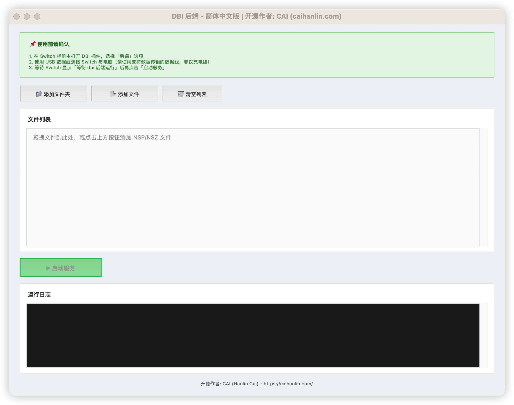

# DBI 后端最新版 / DBI Backend for Nintendo Switch

A GUI-based DBI backend for Nintendo Switch that serves NSP/NSZ game files to the DBI installer via USB or type-C.

为 Nintendo Switch 提供 NSP/NSZ 游戏文件传输的 DBI 后端程序，通过 USB 或 type-C 接口连接。



## 开源作者 / Open Source Author

**Lance CAI** · [https://caihanlin.com/](https://caihanlin.com/)

## 致谢 / Credits

**本项目基于 dev#Mikami 博主的原始代码进行了大量修改与增强。**

This project is heavily modified and enhanced from the original code by dev#Mikami.

dev#Mikami: https://github.com/sskyNS?tab=repositories

---

## 功能特性 / Features

### 中文

- **图形界面**：支持添加文件夹、添加文件、拖拽添加，操作简便
- **自动依赖**：首次运行自动检测并安装 PyUSB、TkinterDnD2、libusb
- **跨架构支持**：自动使用 libusb 包中的库，解决 macOS 上 Anaconda (x86_64) 与 Homebrew (arm64) 的架构冲突
- **线程安全**：日志与退出操作均在主线程执行，避免 Tkinter 崩溃
- **智能过滤**：自动排除 `.DS_Store` 等系统文件
- **命令行支持**：可通过命令行参数预加载文件并自动启动服务

### English

- **Graphical Interface**: Add folders, add files, or drag-and-drop with ease
- **Auto Dependencies**: Automatically detects and installs PyUSB, TkinterDnD2, and libusb on first run
- **Cross-Architecture Support**: Uses bundled libusb to resolve Anaconda (x86_64) vs Homebrew (arm64) conflicts on macOS
- **Thread-Safe**: Log and exit operations run on the main thread to prevent Tkinter crashes
- **Smart Filtering**: Automatically excludes system files like `.DS_Store`
- **CLI Support**: Pre-load files and auto-start the server via command-line arguments

---

## 系统要求 / Requirements

### 中文

- **Python 3.7+**
- **Nintendo Switch**：已安装 DBI，可进入 USB 安装模式
- **USB 数据线**：支持数据传输（非仅充电线）
- **支持平台**：macOS、Windows、Linux

### English

- **Python 3.7+**
- **Nintendo Switch**: DBI installed, capable of entering USB install mode
- **USB Cable**: Data-capable (not charge-only)
- **Platforms**: macOS, Windows, Linux

---

## 安装与运行 / Installation & Run

### 中文

**方式一：直接运行（推荐）**

```bash
python3 dbibackend-zhcn.py
```

脚本会自动检测并安装所需依赖（pyusb、tkinterdnd2、libusb）。首次运行可能需要等待依赖安装完成。

**方式二：命令行预加载文件**

```bash
# 添加单个文件
python3 dbibackend-zhcn.py /path/to/game.nsp

# 添加整个文件夹
python3 dbibackend-zhcn.py /path/to/nsp_folder/

# 添加多个文件或文件夹
python3 dbibackend-zhcn.py file1.nsp file2.nsp /path/to/folder/
```

使用命令行参数时，程序会预加载文件列表并**自动启动服务**。

### English

**Method 1: Direct Run (Recommended)**

```bash
python3 dbibackend-zhcn.py
```

The script will automatically detect and install required dependencies (pyusb, tkinterdnd2, libusb). First run may take a moment for dependency installation.

**Method 2: Pre-load Files via Command Line**

```bash
# Add a single file
python3 dbibackend-zhcn.py /path/to/game.nsp

# Add an entire folder
python3 dbibackend-zhcn.py /path/to/nsp_folder/

# Add multiple files or folders
python3 dbibackend-zhcn.py file1.nsp file2.nsp /path/to/folder/
```

With command-line arguments, the program pre-loads the file list and **auto-starts the server**.

---

## 使用步骤 / Usage Steps

### 中文

1. **在 Switch 上**：打开 DBI，选择「通过 USB 运行」/「Run via USB」，等待屏幕显示「等待 dbi 后端运行」
2. **在电脑上**：运行本脚本，通过「添加文件夹」「添加文件」或拖拽方式添加 NSP/NSZ 文件
3. **连接**：用 USB 线连接 Switch 与电脑
4. **启动服务**：点击「启动服务」按钮
5. **安装**：在 Switch 的 DBI 界面中选择要安装的游戏并开始安装

### English

1. **On Switch**: Open DBI, select "Run via USB", wait for "Waiting for DBI backend" to appear
2. **On PC**: Run this script, add NSP/NSZ files via "Add Folder", "Add Files", or drag-and-drop
3. **Connect**: Connect Switch to PC with a USB cable
4. **Start Server**: Click the "Start Server" button
5. **Install**: Select the game to install in DBI on Switch and begin installation

---

## 界面说明 / GUI Description

### 中文

| 按钮/区域 | 功能 |
|-----------|------|
| 添加文件夹 | 选择文件夹，将该文件夹内所有文件加入列表 |
| 添加文件 | 选择单个或多个文件加入列表 |
| 清空文件列表 | 清空当前文件列表 |
| 启动服务 | 连接 Switch 并开始提供文件传输服务 |
| 文件列表区 | 显示已添加的文件路径 |
| 日志区 | 显示连接状态、传输进度等信息 |

支持将文件或文件夹**拖拽**到窗口内添加。

### English

| Button/Area | Function |
|-------------|----------|
| Add Folder | Select a folder and add all files inside to the list |
| Add Files | Select one or more files to add to the list |
| Clear List | Clear the current file list |
| Start Server | Connect to Switch and start file transfer service |
| File List | Displays paths of added files |
| Log Area | Shows connection status, transfer progress, etc. |

**Drag-and-drop** files or folders onto the window to add them.

---

## 常见问题 / Troubleshooting

### 中文

**Q: 提示 "No backend available" / "找不到 libusb 后端"**  
A: 脚本会自动安装 `libusb` 包。若仍报错，请手动执行：`pip install libusb`

**Q: Switch 显示「等待 dbi 后端运行」但电脑无反应**  
A: 1) 确认已点击「启动服务」；2) 检查 USB 线是否支持数据传输；3) 确认 Switch 已进入 DBI 的 USB 模式

**Q: 使用 Anaconda 时出现架构错误**  
A: 本版本已内置解决：通过 `libusb` 包提供与 Python 架构匹配的库，无需额外配置

**Q: Linux 下无法访问 USB 设备**  
A: 可能需要配置 udev 规则或使用 root 运行，请参考 libusb 官方文档

### English

**Q: "No backend available" / "libusb backend not found"**  
A: The script auto-installs the `libusb` package. If the error persists, run: `pip install libusb`

**Q: Switch shows "Waiting for DBI backend" but PC has no response**  
A: 1) Ensure you clicked "Start Server"; 2) Check that the USB cable supports data transfer; 3) Confirm Switch is in DBI USB mode

**Q: Architecture error when using Anaconda**  
A: This version includes a fix: the `libusb` package provides architecture-matched libraries; no extra configuration needed

**Q: Cannot access USB device on Linux**  
A: You may need to configure udev rules or run as root; refer to libusb documentation

---

## 技术说明 / Technical Notes

### 中文

- **协议**：DBI0 二进制协议，通过 USB bulk 传输
- **设备 ID**：Vendor 0x057E (Nintendo), Product 0x3000
- **传输**：按 1MB 分块读取并发送文件数据

### English

- **Protocol**: DBI0 binary protocol over USB bulk transfer
- **Device ID**: Vendor 0x057E (Nintendo), Product 0x3000
- **Transfer**: Files are read and sent in 1MB chunks

---

## 修改历史 / Modification History

### 中文

相较于 dev#Mikami 的原始版本，本版本主要修改包括：

- 自动依赖安装（pyusb、tkinterdnd2、libusb）
- 使用 libusb 包解决 macOS Anaconda 架构冲突
- Tkinter 线程安全修复（LOG、root.quit）
- 过滤 .DS_Store
- 文件名不存在时的错误处理
- 窗口大小与可调整性优化
- 简体中文界面

### English

Compared to dev#Mikami's original version, this fork includes:

- Auto dependency installation (pyusb, tkinterdnd2, libusb)
- libusb package integration to resolve macOS Anaconda architecture conflicts
- Tkinter thread-safety fixes (LOG, root.quit)
- .DS_Store filtering
- Error handling for missing file names
- Window size and resizability improvements
- Simplified Chinese interface

---

## 许可证 / License

本项目基于原作者的代码进行修改。使用前请遵守 DBI 及 Nintendo 相关使用条款。  
This project is modified from the original author's code. Please comply with DBI and Nintendo terms of use.
